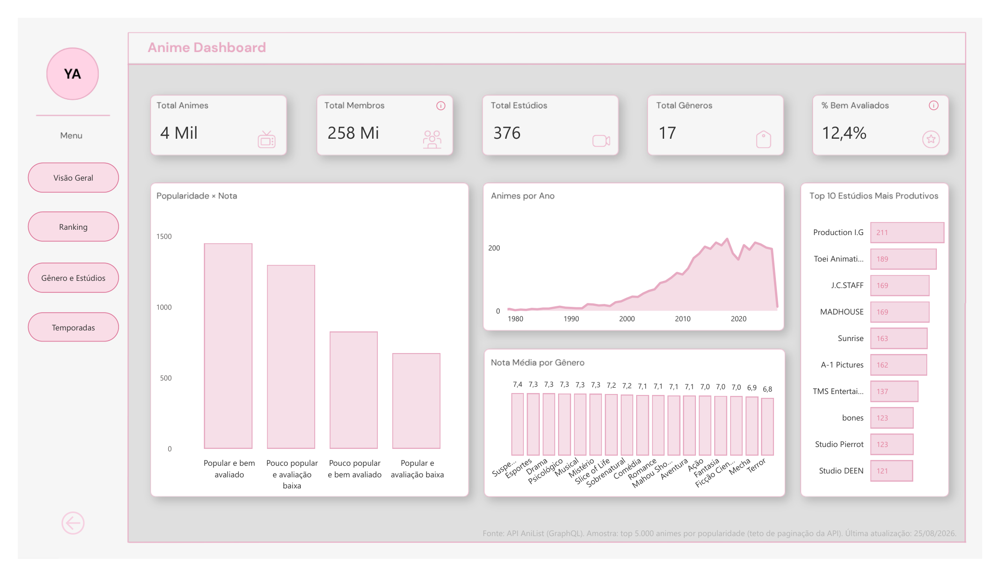
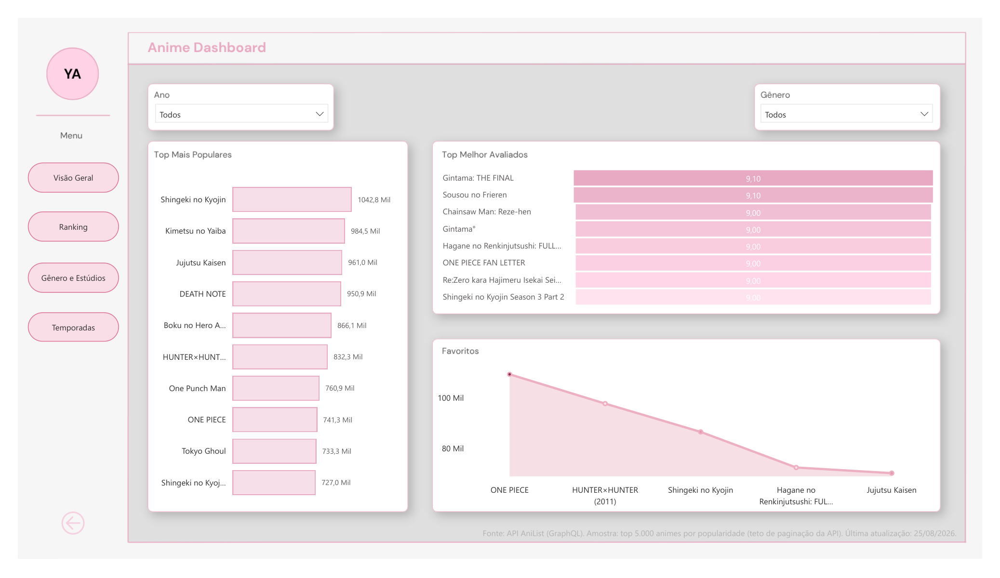
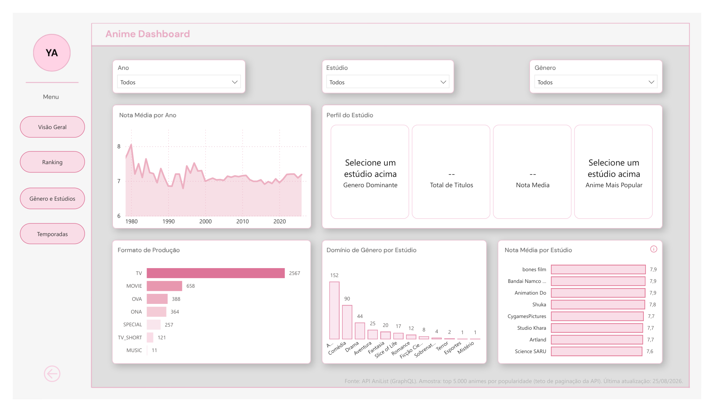
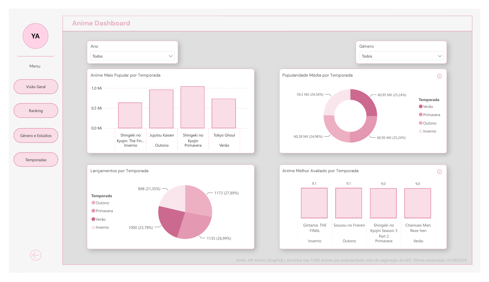

# Análise de Anime — API AniList

Projeto de portfólio (Analista de Dados) que percorre o ciclo completo de um pipeline de dados: da coleta via API pública até um dashboard interativo, passando por modelagem de banco relacional, camada analítica em SQL e tratamento em Python.

**Coleta (API) → Armazenamento (PostgreSQL) → SQL → Tratamento (Python/pandas) → Modelagem dimensional → Power BI**

## Pergunta de negócio

Como nota, popularidade e engajamento do público se comportam entre gêneros e estúdios de anime — e como isso evoluiu ao longo do tempo?

## Stack

- **Coleta:** Python (`requests`), API pública [AniList](https://docs.anilist.co/) (GraphQL)
- **Armazenamento:** PostgreSQL
- **Transformação:** Python (`pandas`), SQL
- **Carga:** SQLAlchemy
- **Visualização:** Power BI

## Status

- ✅ Coleta (`src/coletar_anilist.py`) e tratamento (`src/tratar_dados.py`) completos — 4.378 animes, 376 estúdios e 17 gêneros em `data/processed/`, a partir dos 5.000 animes mais populares da AniList (teto de paginação da própria API).
- ✅ Modelagem dimensional (`sql/ddl.sql`), camada analítica em SQL — views e window functions em `sql/queries_analiticas.sql` — e carga no PostgreSQL (`src/carga_sql.py`) completas.
- ✅ Dashboard no Power BI completo, com 4 páginas (Visão Geral, Ranking, Gênero e Estúdios, Temporadas). Guia de referência em [`docs/guia_powerbi.md`](docs/guia_powerbi.md).

## Como rodar

```bash
python -m venv venv
venv\Scripts\activate
pip install -r requirements.txt
```

Requer [PostgreSQL](https://www.postgresql.org/download/) instalado localmente (ou acessível via rede). Crie um arquivo `.env` na raiz com a variável `DATABASE_URL` apontando para o seu banco, `anime_analytics` (veja `.env.example` como referência). Rode `sql/ddl.sql` nesse banco antes da primeira carga.

```bash
python src/coletar_anilist.py   # popula data/raw/anilist/<data>/
python src/tratar_dados.py      # gera data/processed/*.csv
python src/validar_dados.py     # confere integridade dos CSVs antes de carregar
python src/carga_sql.py         # carrega no Postgres
```

## Estrutura do repositório

```
├── data/
│   ├── raw/anilist/<data>/          # JSON bruto por coleta (paginado)
│   └── processed/                   # CSVs tratados (um por tabela do schema)
├── src/
│   ├── coletar_anilist.py           # coleta via GraphQL com retry/backoff
│   ├── tratar_dados.py              # normaliza JSON bruto -> CSVs
│   ├── validar_dados.py             # checa integridade dos CSVs
│   └── carga_sql.py                 # carrega CSVs no Postgres
├── sql/
│   ├── ddl.sql                      # schema: dim_anime, dim_genero, dim_estudio,
│   │                                 # pontes N:N, fato_anime_metricas
│   └── queries_analiticas.sql       # views + window functions
├── docs/
│   └── guia_powerbi.md              # guia de referência do dashboard
└── dashboard/
    ├── anime_dashboard.pbix
    └── anime_dashboard.pdf
```

## Dashboard

O dashboard completo (Power BI, 4 páginas) está em [`dashboard/anime_dashboard.pbix`](dashboard/anime_dashboard.pbix). Para interagir com os filtros, basta abrir no [Power BI Desktop](https://www.microsoft.com/pt-br/power-platform/products/power-bi/desktop) — gratuito, e não é preciso conexão com banco, já que os dados vêm embutidos no próprio arquivo.

Também disponível:
- **PDF estático** (sem interatividade): [`dashboard/anime_dashboard.pdf`](dashboard/anime_dashboard.pdf)
- **Vídeo demonstrativo**: [assista aqui](https://youtu.be/1ACAOAdmqOw)

### Prints

| Visão Geral | Ranking |
|---|---|
|  |  |

| Gênero e Estúdios | Temporadas |
|---|---|
|  |  |

## Principais insights

- **Toei Animation** é o estúdio mais especializado entre os de maior catálogo: 75,7% de seus 189 títulos são do gênero Action.
- **Terror** é o gênero pior avaliado da base (nota média 6,78) — mas com volume de produção relativamente baixo, tem potencial de "descoberta" pra quem busca fora do mainstream.
- Apesar de o **outono** ser a temporada com mais lançamentos (1.173 títulos), o **inverno** concentra 2 dos 4 melhores avaliados de todos os tempos, incluindo *Gintama: THE FINAL* (nota 9,1).
- Nota e popularidade **não andam sempre juntas**: dividindo a base pela mediana de cada eixo, quase metade dos animes analisados (1.297 de 4.245) cai no quadrante "pouco popular e avaliação baixa", contra só 673 no quadrante oposto.

## Limitações conhecidas

- As medidas do dashboard assumem uma única coleta de dados (ver nota no [`CLAUDE.md`](CLAUDE.md) sobre isso).
- `rank` e `popularity` (colunas de ranking da AniList) ficam nulos em ~80% dos registros — a API só atribui esses rankings "all-time" a uma fração dos títulos.
- 161 animes (3,7%) não têm estúdio de animação confirmado pela AniList e não aparecem em filtros por Estúdio; 9 animes não têm gênero listado.
